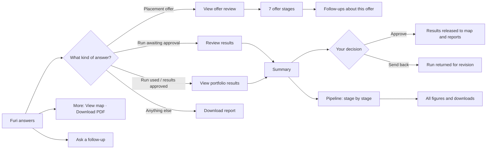

# After Furi answers: what an underwriter can do next

This page covers everything that happens **after** a question is answered in **Ask Furi**: what each answer contains, which buttons appear and why, and the flows they lead to. For how to ask questions and add files, see [underwriter-chatbot-guide.md](underwriter-chatbot-guide.md).

Furi informs a decision; it never makes one. Nothing in these flows approves cover, binds a risk or confirms a property without an underwriter clicking a button that says so.

## 1. What every answer contains

| Part | What it is | What you can do |
|---|---|---|
| **Answer** | A short Markdown briefing with key figures in KES. It labels each figure as supplied, proxy, assumed, draft or approved. | Long answers are folded. Click **Read full answer** / **Show less**. |
| **Offer check card** | Only when the question was a placement offer: "Offer checks are ready", with how many stages are complete and how many need attention. | Read at a glance; open the full review with **View offer review**. |
| **Sources used** | The files, pages, rows, properties, hotspots or model runs the answer relied on (up to four are named). | Expand it to check where a figure came from before you rely on it. |
| **Action bar** | One main button plus **More**. Which main button you get depends on the answer (section 2). | Open the next step in one click. |

An answer that failed (backend unavailable, file still processing, too many files and so on) shows the error message and its source, **with no action bar**. Fix the cause and ask again.

If all AI providers are down, you still get an answer: a data-only summary that says the AI models are unavailable. The actions work as normal.

## 2. Which main button appears, and when

The main button is chosen in this order. The first rule that matches wins.

| If the answer… | Main button | It opens |
|---|---|---|
| reviewed a placement offer | **View offer review** | The single-offer workflow, beside the chat |
| started or found a portfolio run **waiting for approval** | **Review results** | The portfolio results, ready for your decision |
| used a portfolio run, or results are already approved | **View portfolio results** | The portfolio results Summary |
| none of the above | **Download report** | A PDF briefing of this answer |

**More ▾** always offers **View map**. It also offers **Download PDF** whenever the main button isn't already the report.

Separately from the answers, the **results banner** pinned at the top of the chat always gives one-click access to the portfolio results: **Review** (red, waiting for you), **View results** (green, approved) or **Calculate** (grey, nothing yet).

## 3. Portfolio screen specification

The Portfolio section is an underwriting decision surface, not a property catalogue. Its default view must answer the first two questions without requiring navigation, while making the impact of accepting a new risk the primary next action.

### 3.1 Underwriter jobs, in priority order

| Priority | Underwriter question | Information required on screen |
|---|---|---|
| 1. See the book | **How much do I have, and where?** | Total insured value, property count, split by housing class and region, the portfolio map, and a ranked list. |
| 2. Spot accumulation | **Is too much value exposed to the same flood?** | Clusters with insured value, loss at 1-in-100, share of the book, an accumulation warning, and the top 10 properties' share of loss. |
| 3. Check a new risk against the book | **What does adding this offer do to my exposure?** | Before/after portfolio 1-in-100 loss and before/after metrics for the cluster where the offer would land. This is the key decision flow. |
| 4. Trust the data | **Can I rely on these numbers?** | A data-quality score, unconfirmed row count, warnings, and a direct link to the review queue. |

### 3.2 Default Portfolio view

Portfolio and Accumulation are one section and one navigation destination. The first viewport must show, without clicks:

- A compact book summary: total insured value, property count, portfolio 1-in-100 loss, and data-quality badge.
- A map grouped by accumulation cluster. Cluster size represents value; the visual state represents 1-in-100 loss concentration and warning status.
- The top five clusters ranked by 1-in-100 loss share. Each row shows cluster name, insured value, 1-in-100 loss, share of book loss, property count, and warning state.
- A ranked list of the highest-loss properties, with the top 10's combined share of portfolio 1-in-100 loss shown above or beside the list.
- Any accumulation warning in plain language, for example: `Westlands holds 31% of portfolio 1-in-100 loss across 14 properties.`

The lower part of the same Portfolio page contains the accumulation analysis: uploaded insured-asset datasets, the fixed Nairobi susceptibility reference, scenario controls, regional breakdown and selected-property comparison. It must not appear as a separate rail item or separate underwriting destination.

Search and filters sit above this content and refine it; they do not replace the default summary. The main action is **Add to portfolio / See impact**, which links directly to the offer-review flow.

### 3.3 Search and filters

Search supports property ID, neighbourhood and value. Filters support:

- Housing class
- Flood probability
- Modelled loss
- Review status and data-quality warnings
- Cluster or region

The interface should support questions such as: `masonry buildings above KES 30m with flood probability above 10%`. A filtered result updates both the ranked list and map while the book totals remain clearly labelled as either **whole book** or **filtered view**.

### 3.4 Add to portfolio / See impact

This is the main path from a placement offer to a portfolio decision.

1. The underwriter starts from an offer review and chooses **Add to portfolio / See impact**.
2. Furika extracts or receives the proposed property's location, class and insured value. Missing or uncertain fields are shown as required inputs, not silently guessed.
3. The impact view identifies the cluster the offer would enter and shows the source and confidence for that assignment.
4. The view compares **Before** and **After** for:
  - Total insured value
  - Property count
  - Portfolio 1-in-100 loss
  - Portfolio loss share for the affected cluster
  - Cluster insured value
  - Cluster 1-in-100 loss
  - The offer's incremental loss and share of cluster loss
5. A delta column states the change in KES and percentage points. Increases are visually prominent; a reduction is not presented as a warning.
6. The underwriter can inspect the nearby properties and the cluster's current top-loss properties before deciding.
7. The action is **Confirm and add** only after the underwriter has reviewed the assumptions. **Cancel** leaves the book unchanged.

The impact view must make the decision legible: a low-risk building can still be a bad addition when it lands in a cluster that already carries a large share of the book's loss. The offer remains separate from the book until the underwriter confirms the addition.

### 3.5 Data quality and trust

The data-quality badge is always visible in the Portfolio header. Clicking it opens a compact panel containing:

- Overall data-quality score and what it measures
- Unconfirmed rows and properties excluded from model runs
- Warning and error counts
- Missing or interpolated hazard scores
- Approximate geocodes
- The latest upload or run used for the displayed figures
- **Open review queue**

Warnings are attached to the affected property, cluster or figure. The user should not need to leave the Portfolio view to understand why a number is provisional.

### 3.6 Supporting jobs

These functions support the main decision without competing with it:

- **Inspect one property:** open its page for loss at each return period, annual flood probability, rating explanation, provenance and data gaps.
- **Set limits:** let the underwriter set a value or 1-in-100 loss cap per zone, then show which clusters breach it and by how much. Thresholds are user-set and must be labelled as such.
- **Act:** flag a property for referral, add a note, and export a selected list for a reinsurer or broker.
- **See what changed:** compare the current book with the last upload or model run, showing added, removed, changed and newly unconfirmed records.

Detailed tables, per-property charts, provenance and notes belong on the property page or a dedicated review view, not in the default Portfolio viewport.

### 3.7 Design rules

1. The default view answers “how much/where?” and “is value concentrated?” without clicks.
2. Search and filters remain above the map and ranked results.
3. **Add to portfolio / See impact** is a primary action because it connects the Portfolio section to offer review.
4. Data quality is a persistent badge with details one click away.
5. Detailed tables and property charts stay behind the property page.
6. Every before/after figure identifies its scope, run status and assumptions.

## 4. The flows

### Flow A: Review and decide on a portfolio run

Starts from **Review results** on an answer, or **Review** on the results banner.

1. The **Summary** opens beside the chat, starting with **The bottom line**: insured value, expected flood cost per year, and the 1-in-100 year loss with its net figure after reinsurance.
2. Directly under it, **things to check before you decide** lists only real warnings, in plain words. Click one to open the evidence behind it.
3. **Approve** or **Send back** sits right there (and again at the end of the Summary).
   - **Approve** releases the results to the map and reports. The banner turns green.
   - **Send back** returns the run for revision. Nothing is released.
4. To check more before deciding, scroll the five questions:
   - What are we covering?
   - How much of it can flood?
   - What could it cost us?
   - Is the risk concentrated?
   - Can we trust these numbers?

   Each has a one-sentence answer and a simple picture, with a **Simple / Bar chart** switch.

A run waiting for review is a **draft**. Furi always describes it that way and never treats it as an underwriting decision.

**Clicks:** 2 to approve (Review → Approve).

### Flow B: Explore portfolio results

Starts from **View portfolio results** or **View results**.

- **Summary** (default): the story of the run, as in flow A.
- **Pipeline** (switch at the top): the eight stages in order. Click any stage to see what it does, its result and one picture.
  - **Flood exposure**: every flood size side by side, and how susceptibility scores become water depth.
  - **Financial engine**:
    - one real building worked through (score → depth → damage ratio → × value → ground-up → gross);
    - the loss waterfall from ground-up to gross to net for each flood size;
    - the EP table with AAL;
    - every assumption, listed openly.
  - **Underwriter review**: the automatic model checks and the decision buttons.
- **Replay** plays the stages again as an animation; **Skip** jumps to the end.
- **All figures and downloads** (from a Summary question or a stage) opens the full figure set for that stage, with **CSV**, **JSON** and **All stages** downloads and PNG/CSV for each chart.

**Clicks:** 3 to the financial engine (View results → Pipeline → Financial engine).

### Flow C: Ask about one stage of the model

Inside **All figures and downloads**, click **Ask assistant**. A side chat opens that answers about **that stage only**, using its figures. Suggested starts:

- *Explain these metrics in plain language*
- *What needs attention in this stage?*
- *Which assumptions drive these numbers?*

The stage chat is separate from the main conversation and is cleared when you change stage.

### Flow D: Review a single placement offer

Starts when the answer reviewed a pasted offer or an uploaded offer document.

1. **View offer review** opens the offer workflow beside the chat. It starts on the financial loss check where available.
2. Click through the **seven stages** (data extraction, hazard, vulnerability, financial loss, portfolio accumulation, underwriting checks, human review). Each shows its status (*Done*, *Check*, *Unavailable*, *Your review*), a summary, a visual where relevant, and **Why this result?** with the evidence and assumptions.
3. **View map** shows the offer's location only. Portfolio properties are hidden so the offer isn't mixed with the book.
4. While the composer shows **Reviewing one offer: …**, every follow-up is about this offer only, for example:
   - *What should I verify with the broker?*
   - *What deductible issue should I review?*
   - *What is the modelled 1-in-100 loss?*
5. To compare the offer with insured properties within 1 km, ask for it explicitly: *Compare this offer's accumulation with nearby insured properties.* That comparison is never done silently.
6. **Clear** (in the offer bar) leaves offer mode. Choosing other files for a question also clears it.
7. **Open separate portfolio workflow** switches the right-hand panel back to portfolio results.

The human review stage always waits for you. No cover is approved and no property is added to the portfolio.

**Clicks:** 1 to the review (View offer review).

### Flow E: Look at it on the map

Starts from **More ▾ → View map**, or **Map** in the chat header.

- Pick a flood scenario with the tier control. Layers (properties, flood clusters, rain, pulse) can be switched off.
- Click a property pin or hotspot for its details, then **Ask Furika Bot about this location**. Furi gets a new question with that place attached as context and prioritises it in the answer.
- During an offer review the map shows only the offer location (flow D).

**Clicks:** 3 from the chat to a question about a pinned property (Map → pin → Ask).

### Flow F: Download a PDF briefing

**Download report** (main button) or **More ▾ → Download PDF**. The PDF is built in the browser from this answer and contains:

- the question and an executive summary;
- the analysis;
- the workflow or placement checks;
- the evidence and sources;
- the limitations.

Every page is labelled **AI-GENERATED ANALYSIS | HUMAN REVIEW REQUIRED**.

### Flow G: Keep the conversation going

- **Follow-up questions** keep their context:
  - an active offer stays the subject until you **Clear** it;
  - files you add are used for that question;
  - a property you asked about from the map or Portfolio is attached.
- **Chats** reopens any of the last 12 conversations, including an offer review in progress. **New** starts a fresh one.
- If the page refreshed before an answer was saved, the question shows **Retry**, which resends it with its original context.

Conversation history is kept **in this browser only**. It isn't shared with colleagues or other devices.

## 5. What always stays with the underwriter

- Approving or sending back a portfolio run (flow A).
- Accepting an offer, and verifying anything flagged with the broker (flow D).
- Confirming source rows, coordinates, construction class, TIV and terms before relying on a figure. Use **Sources used** and **All figures**.
- Treating proxy, assumed and draft figures as such. The financial engine's insurance terms (deductible, limit, quota share, cat XL) are **assumptions** until real terms are supplied.

## 6. Known gaps (for the product team)

| Gap | Effect | Where |
|---|---|---|
| The "AI-structured exposure" card (**Confirm & recalculate** / **Discard**) is never opened: nothing sets it. | Underwriters can't add a proposed asset from the chat. Either wire it up or remove it. | `ExposurePreview`, `preview` state in `furika_vote/src/main.jsx` |
| A PDF can only be made from an answer. | There is no one-click report from the results Summary. | `chatReportPdf.js` takes a chat message |
| Chat history lives in browser storage; the `/chats` API exists but the panel doesn't use it. | History is lost with cleared storage or on another device. | `chatPersistence.js` |
| A failed answer has no action bar. | You can't open results or the map from an error, though the results banner and Map button still work. | `ResponseActions` only renders for successful answers |
