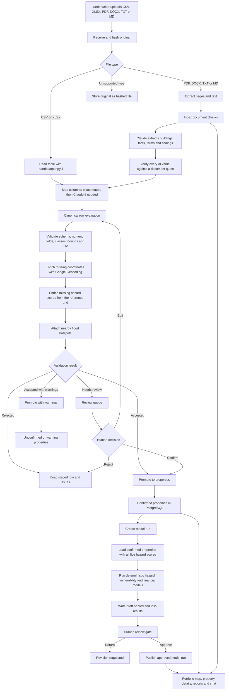

# Furika AI model workflow

This document describes the implemented workflow for the Furika AI Nairobi flood-risk prototype. The system uses synthetic or redacted exposure data. AI assists with bounded extraction and analysis, but it does not calculate hazard, vulnerability, loss, EP or AAL.

## End-to-end workflow

## Deterministic model calculation chain

Only confirmed properties that have a valid housing class, coordinates, insured value and all five hazard scores enter this calculation path.

```mermaid
flowchart LR
    A[Confirmed exposure rows] --> B[Validate exposure]
    B --> C[Hazard score 0 to 1]
    C --> D[Score to proxy depth: score x D_max]
    D --> E[Assign assumed return periods]
    E --> F[Depth by scenario and property]
    F --> G[Sigmoid depth-damage curve by housing class]
    G --> H[Mean damage ratio]
    H --> I[Property ground-up loss = damage ratio x TIV]
    I --> J[Aggregate portfolio loss by scenario]
    J --> K[EP curve]
    K --> L[AAL range and central AAL]
    I --> M[Property hazard and loss results]
    J --> N[Class breakdown, top risks and accumulation metrics]
    L --> N
    M --> O[Draft results for human approval]
    N --> O
```

## Workflow stages exposed by the API

A model run records these stages in `app/services/model_runs.py`:

1. `data_validation`
2. `hazard_modelling`
3. `vulnerability_mapping`
4. `exposure_join`
5. `financial_loss`
6. `ai_intelligence`
7. `human_review`
8. `publish`

The API is rooted at `/api/v1`. Important endpoints are:

- `POST /portfolios/{id}/uploads`: receive and process an exposure or document.
- `GET /uploads/{id}`: inspect ingestion status, row counts and issues.
- `GET /portfolios/{id}/review-queue`: list rows awaiting review.
- `POST /upload-rows/{id}/decision`: confirm, edit or reject a staged row.
- `POST /model-runs`: calculate a new draft model run.
- `GET /model-runs/{id}/events`: stream run progress.
- `POST /model-runs/{id}/decision`: approve or return the run.
- `GET /model-runs/{id}/report`: retrieve an approved report.
- `POST /chat`: answer questions using selected database evidence and model results.

## Tools and technologies used

### Backend and API

| Area | Technology | Role |
|---|---|---|
| Web framework | Python, Flask 3.1 | Application server and request handling |
| API layer | Flask-RESTX | Versioned REST API, Swagger/OpenAPI documentation |
| ORM and schema | Flask-SQLAlchemy, SQLAlchemy | Database models and queries |
| Database | PostgreSQL 17 | Portfolios, properties, uploads, provenance, issues, runs and results |
| Database operations | Flask-Migrate/Alembic | Migration support |
| Production server | Gunicorn | WSGI deployment |
| Local infrastructure | Docker Compose | PostgreSQL development service |
| Configuration | python-dotenv and environment variables | API keys, database URL and runtime settings |

### Data ingestion and modelling

| Area | Technology | Role |
|---|---|---|
| Tabular processing | pandas | CSV/XLSX reading, canonical rows, aggregation and EP data |
| Numerical modelling | NumPy | Vectorised hazard, vulnerability, loss and distance calculations |
| Spreadsheet files | openpyxl | Excel workbook support |
| PDF parsing | pypdf | PDF text extraction and page handling |
| Word documents | python-docx | DOCX paragraphs and tables |
| File storage | Local filesystem with SHA-256 hashes | Immutable upload originals and temporary files |
| Core model | Custom Python services | Hazard-to-depth, vulnerability, property loss, EP curve, AAL and sensitivity |
| Testing | pytest | Unit, integration and API verification |

### AI and external services

| Service | Technology/model | Role and guardrail |
|---|---|---|
| Document extraction and column mapping | Anthropic Claude, configured as `claude-opus-5-5` | Structured extraction and mapping; AI values require a source quote |
| Chat analysis | Claude, then Google Gemini | Answers from server-selected database evidence; AI does not calculate losses |
| Legacy or optional chat fallback | OpenAI Responses API | Present in the standalone frontend server path; disabled unless configured |
| Geocoding | Google Geocoding REST API | Converts addresses to coordinates and records precision |
| Reference hazards | Scored Nairobi reference grid | Inverse-distance interpolation for rows without supplied hazard scores |
| Hotspots | CSV reference data | Nearby hotspot context and review signals |

### Frontend

| Area | Technology | Role |
|---|---|---|
| UI framework | React | Portfolio, map, upload, review, workflow and chat screens |
| Build tool | Vite | Development server and production bundling |
| Frontend server | Node.js and Express | Serves the app and provides the legacy standalone chat route |
| Icons | lucide-react | Interface icons |
| Maps | Google Maps JavaScript API | Portfolio properties, hotspots and map interactions |
| Reports | jsPDF | Client-side report/PDF output |
| API configuration | Vite environment variables | Backend URL and portfolio selection |

## Important modelling boundary

The model is deterministic and scenario-based. Hazard scores are susceptibility proxies, depths and return periods are assumptions, and vulnerability curves are not calibrated to Kenyan claims. The implementation has internal consistency checks, but it has not been validated against observed flood extents or observed losses for this synthetic portfolio.

Related source documentation:

- [Backend README](../README.md)
- [Model documentation](model-documentation.md)
- [Ingestion plan](ingestion-plan.md)
- [Deterministic model](../app/services/furika_model.py)
- [Model-run workflow](../app/services/model_runs.py)
- [Ingestion pipeline](../app/services/ingestion/pipeline.py)
